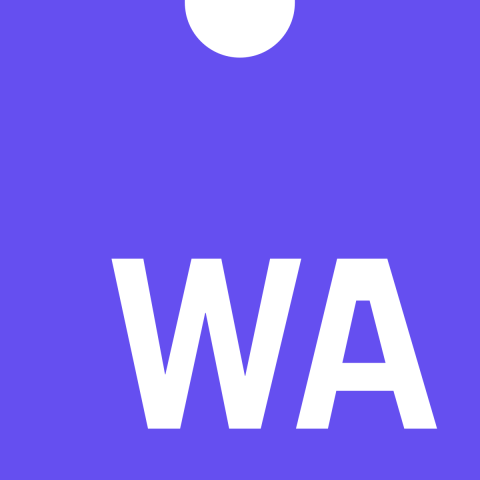
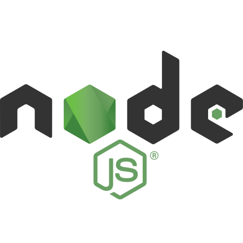

### Hi there 👋

 

<h1 style="font-family: Luminari, fantasy, 'Times New Roman'; letter-spacing: 5px;">MY EXPERIENCE</h1>
<table>
  <tr style="border: none">
    <td style="border: none"><a href="https://www.javascript.com"><a/></td>
    <td style="border: none"><a href="https://p5js.org"><a/></td>
    <td style="border: none"><a href="https://webassembly.org"><a/></td>
    <td style="border: none"><a href="https://www.npmjs.com"><a/></td>

  </tr>
  <tr style="border: none">
    <td style="border: none"><a href="https://www.java.com/tr/"><a/></td>
    <td style="border: none"><a href="https://openjfx.io"><a/></td>
    <td style="border: none"><a href="https://www.mysql.com"><a/></td>
    <td style="border: none"><a href="https://maven.apache.org"><a/></td>
  </tr>
  <tr>
    <td style="border: none"><a href="https://nodejs.org/en/"><a/></td>
    <td style="border: none"><a href="https://www.mongodb.com"><a/></td>
    <td style="border: none"><a href="https://spring.io"><a/></td>
  </tr>
</table>

